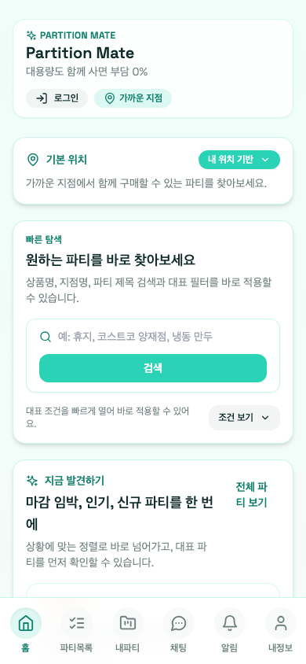
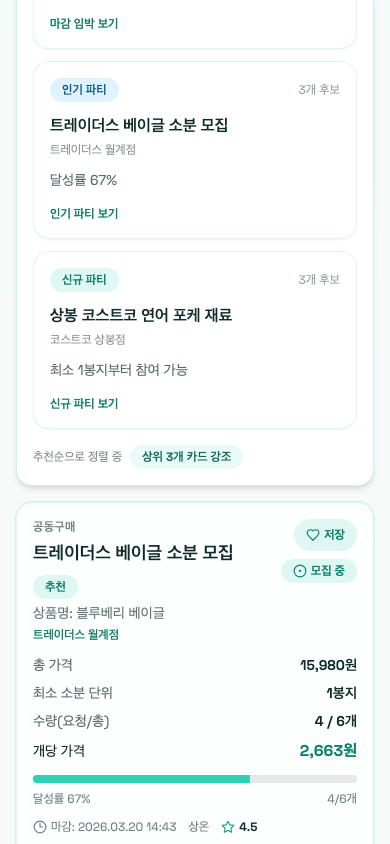
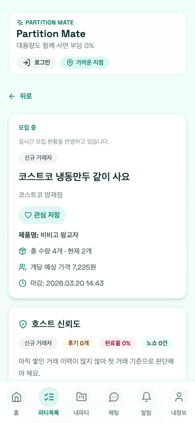
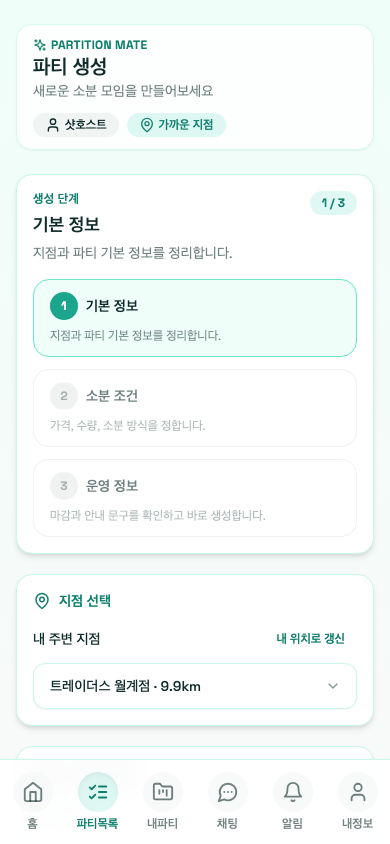
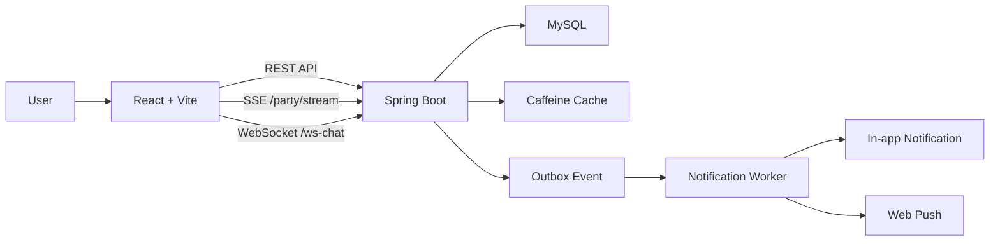

# Partition Mate

> 위치 기반 공동구매/소분 플랫폼  
> 동시 참여 제어, 실시간 상태 동기화, 운영 알림까지 하나의 흐름으로 연결한 풀스택 프로젝트

## 프로젝트 소개

대형마트 공동구매 서비스는 단순히 파티를 모집하는 것에서 끝나지 않습니다.  
동시에 여러 사용자가 같은 파티에 참여할 때 초과 모집이 발생하지 않아야 하고, 정원이 찬 뒤에는 남은 수량 부족 요청을 즉시 차단해야 하며, 모집 이후에도 마감, 정산, 픽업, 후기, 알림까지 상태 변화가 계속 이어집니다.

이 프로젝트는 이런 문제를 다음 관점에서 풀었습니다.

- `동시성 제어`: 같은 파티에 참여 요청이 몰려도 초과 모집과 중복 참여를 막는다.
- `상태 동기화`: 참여, 취소, 자동 마감을 여러 화면에 실시간으로 반영한다.
- `운영 흐름 연결`: 모집 이후 정산, 픽업, 후기, 신뢰도, 신고/차단까지 이어지는 흐름을 설계한다.
- `세션 안정화`: 짧은 수명 JWT 구조에서도 사용자가 다시 로그인하지 않고 세션을 복구할 수 있게 한다.

## 모바일 주요 화면

<table>
  <tr>
    <td align="center">
      <br />
      홈
    </td>
    <td align="center">
      <br />
      파티 목록
    </td>
  </tr>
  <tr>
    <td align="center">
      <br />
      파티 상세
    </td>
    <td align="center">
      <br />
      파티 생성
    </td>
  </tr>
</table>

## 어떤 문제를 해결했는가

### 1. 공동구매 모집은 동시 요청에 취약하다
- 남은 수량을 동시에 읽고 저장하면 초과 모집이 발생할 수 있다.
- API 레벨 중복 검증만으로는 flush 시점 충돌을 일관되게 다루기 어렵다.

### 2. 모집 이후 상태 변화가 많아 화면 정합성이 쉽게 깨진다
- 참여 확정, 취소, 자동 마감이 여러 화면에서 동시에 반영되어야 한다.
- 채팅은 양방향 통신이 필요하지만, 모집 상태 갱신은 단방향 푸시가 더 적합하다.

### 3. 위치 기반 탐색은 반복 조회가 잦아 체감 성능이 중요하다
- 홈/지점 탐색 화면은 주변 지점 조회와 파티 목록 재조회가 자주 발생한다.
- 단순 조회 방식으로는 warm path 최적화가 어렵다.

### 4. JWT만으로는 세션 경험이 쉽게 끊긴다
- access token 만료 시 매번 로그인으로 보내면 보호 API UX가 나빠진다.
- refresh token을 프론트 저장소에 직접 들고 있지 않으면서도 rotation과 로그아웃 무효화가 가능해야 했다.

## 핵심 성과

### 정량 성과
- 서비스 계층 + H2 기준 동시 참여 300건 시나리오에서 `초과 모집 0건`, `중복 참여 0건`을 확인했습니다.
- 같은 시나리오의 서비스 계층 + H2 측정에서 평균 응답시간 `119.99ms`, P95 `196.30ms`, P99 `382.89ms`를 기록했습니다.
- HTTP + MySQL 기준 동시 참여 300건 측정에서도 `초과 모집 0건`, `중복 참여 0건`을 유지했고 평균 `557.45ms`, P95 `795.11ms`, P99 `907.52ms`를 기록했습니다.
- 주변 지점 조회 API는 평균 `71.78ms -> 12.49ms`로 `82.60%` 감소했습니다.
- 같은 조회의 warm path는 평균 `1.64ms`, P95 `2.26ms`, cache hit ratio `0.95`까지 낮췄습니다.

### 참고 문서
- [동시 참여 부하 측정](docs/benchmarks/E1-5-party-join-load-benchmark.md)
- [동시 참여 HTTP + MySQL 측정](docs/benchmarks/E1-5-party-join-http-mysql-benchmark.md)
- [위치 기반 조회 성능 비교](docs/benchmarks/E2-5-store-query-performance-comparison.md)

> 위 수치는 각각 `H2 in-memory` 기반 서비스 벤치마크, 로컬 Docker `HTTP + MySQL` 벤치마크, `MockMvc + H2` 기준 측정값이며, 운영 환경 수치와 동일하다고 주장하지 않습니다.

## 기술적으로 집중한 설계 포인트

| 문제 | 선택 | 이유 |
| --- | --- | --- |
| 파티 참여 초과 모집 방지 | `PESSIMISTIC_WRITE` 락 + `saveAndFlush` | 단일 DB 구조에서 가장 단순하게 정합성을 보장하고, DB 유니크 제약 충돌도 서비스 레벨에서 일관된 예외로 변환하기 위해 |
| 실시간 모집 현황 반영 | 공개 SSE + 보호 화면 fallback 재조회 | 공개 파티 상태는 단방향 전파로 충분하고, 현재 JWT 인증 구조에서 브라우저 `EventSource` 제약을 우회하기보다 단순한 공개 스트림이 더 적합했기 때문 |
| 파티 채팅 | `WebSocket + STOMP` | 채팅은 양방향 통신과 재연결이 핵심이며, 파티 단위 구독 모델을 명확하게 유지할 수 있기 때문 |
| 알림 정합성 | Outbox 패턴 + 워커 재처리 | 도메인 상태 변경과 알림 이벤트 저장을 같은 트랜잭션에 묶고, 실제 발송은 비동기로 분리하기 위해 |
| 세션 복구 | `HttpOnly Cookie` refresh token + rotation | refresh token을 프론트 JS에서 직접 다루지 않으면서도 재발급, 로그아웃 무효화, 기기 단위 제어를 가능하게 하기 위해 |

## 주요 기능

### 모집과 참여 제어
- 파티 생성, 수정, 호스트 종료
- 동시 참여 제어
- 잔여 수량 부족 시 즉시 실패 응답
- 참여 취소 시 잔여 수량과 파티 상태 재계산

### 실시간 반영
- `GET /party/stream` SSE 기반 모집 상태 동기화
- 연결 오류 시 선형 backoff 재연결
- 보호 화면은 API 재조회로 fallback 보정

### 거래 운영
- 모집 예상가와 실구매가를 분리해 정산 금액 계산
- 참여자 입금 완료, 호스트 확인, 환불 상태 추적
- 픽업 시간/장소 확정 및 참여자 확인
- 거래 완료 후 후기 작성과 신뢰도 반영

### 안전 기능
- 신고 접수
- 사용자 차단과 상호작용 제한
- 노쇼 누적 정책
- 신뢰 배지, 경고 신호 노출

### 알림과 채팅
- 앱 내 알림 조회
- Web Push 구독 및 설정
- 파티 전용 인앱 채팅
- 안 읽은 메시지 수, 호스트 공지 고정

## 아키텍처



## 기술 스택

### Backend
- Java 21
- Spring Boot 3.5
- Spring Web
- Spring Data JPA
- Spring Security
- Spring WebSocket
- MySQL 8
- JWT
- Caffeine Cache

### Frontend
- React 18
- Vite
- React Router
- Tailwind CSS
- STOMP.js
- Vitest
- React Testing Library

## 실행 방법

### 1. DB 실행
```bash
docker compose up -d db
```

### 2. 백엔드 실행
```bash
./mvnw spring-boot:run
```

기본 포트는 `8080`입니다.

### 3. 프론트엔드 실행
```bash
cd frontend
npm install
npm run dev
```

기본 개발 서버는 `5173`입니다.  
백엔드 기본 주소는 `http://localhost:8080`입니다.

### 4. 선택 환경변수

프론트에서 주소 검색/지도 연동까지 쓰려면 `frontend/.env.local`에 아래 값을 둘 수 있습니다.

```bash
VITE_API_BASE=http://localhost:8080
VITE_KAKAO_MAP_KEY=your_kakao_javascript_key
```

백엔드 기본 환경변수는 [`.env.example`](.env.example), [`src/main/resources/application.yml`](src/main/resources/application.yml), [`docs/local-db.md`](docs/local-db.md)에 정리돼 있습니다.

## 테스트

백엔드:

```bash
./mvnw test
```

프론트엔드:

```bash
cd frontend
npm test
```

## 프로젝트 구조

```text
.
├── src/main/java           # Spring Boot 백엔드
├── src/main/resources      # application.yml, 시드 데이터
├── frontend                # React/Vite 프론트엔드
├── docs/adr                # 아키텍처 결정 기록
├── docs/specs              # 기능/이벤트 스펙
├── docs/benchmarks         # 성능 측정 결과
└── docs/agent-roadmap.md   # 구현 백로그 및 메모
```
